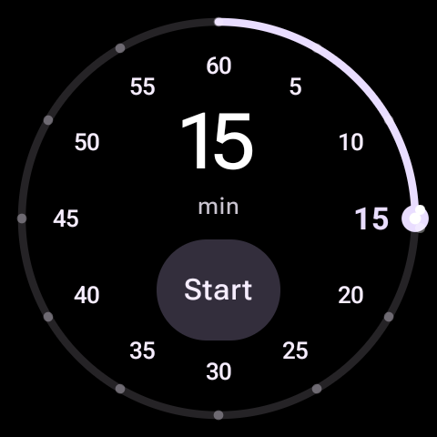
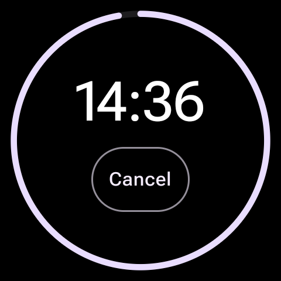
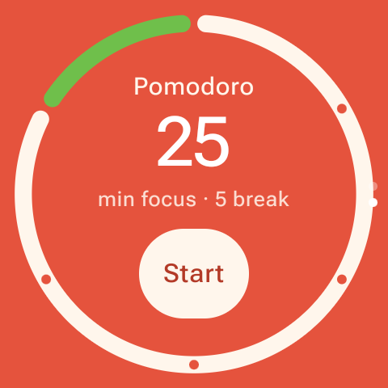
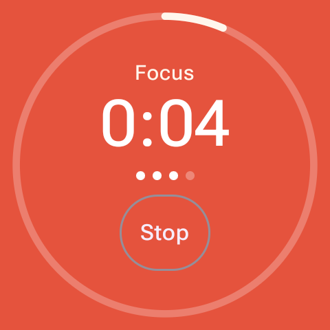

# MyTimer

A rotary-dial countdown timer for Wear OS, with a swipe-up Pomodoro mode.

<p align="center">
  
  
  
  
</p>

## Features

- **Rotary dial timer** — a clock-face dial with 5-minute marks from 5 to 60. Turn the bezel to pick a duration, tap **Start**.
- **Pomodoro** — swipe up for a fixed 25-minute focus / 5-minute break cycle, with a 15-minute long break after every fourth session. Each transition beeps and vibrates briefly; the cycle loops until you tap **Stop**.
- **Runs in the background** — the countdown lives in a foreground service and phase ends are exact `AlarmManager` alarms, so timers fire on time even after the watch goes to sleep. An ongoing-activity chip on the watch face shows time remaining.
- **"My Apps" tile** — a tile with shortcuts to MyTimer and MyRun.

## Building

Open the project in Android Studio and run the `app` configuration on a Wear OS device or emulator (minSdk 30), or from the command line:

```sh
./gradlew assembleDebug
adb install -r app/build/outputs/apk/debug/app-debug.apk
```

## Notes on timing

Phase ends are scheduled with `AlarmManager.setAlarmClock` rather than a sleeping coroutine: a foreground service keeps the process alive, but only an alarm wakes the CPU once the watch has dozed. `setAlarmClock` is used instead of `setExactAndAllowWhileIdle` because the latter is throttled to one alarm per nine minutes in doze, which would delay five-minute breaks.
